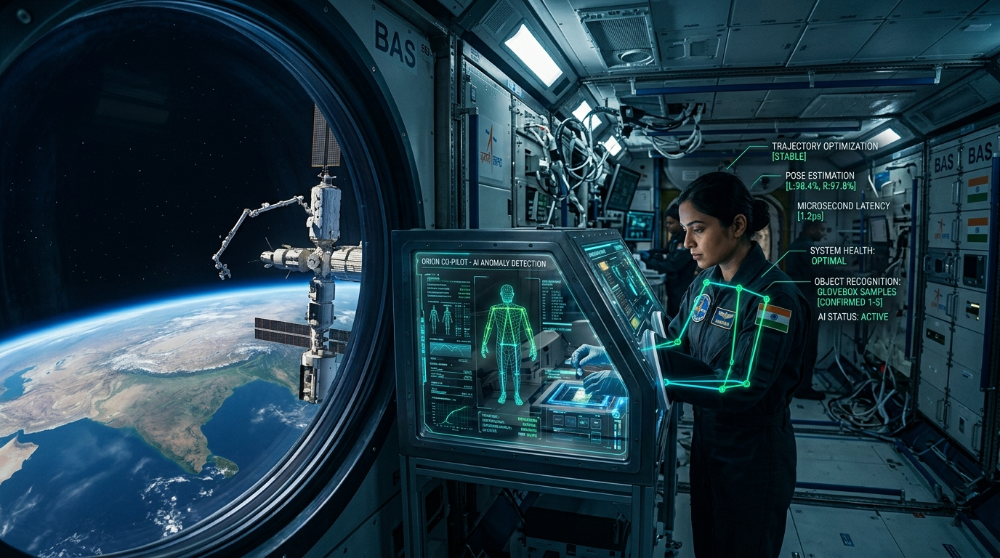
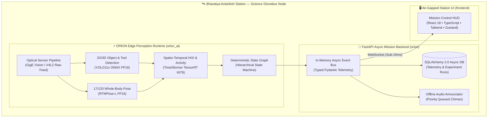

<div align="center">

# 🛰️ ORION BAS AI Copilot (`orion-bas-ai`)
### Autonomous Edge AI Human Activity Recognition & Experiment Protocol Verification Engine



[](https://github.com/amitraghvan/Orion)
[]()
[](https://www.python.org/)
[](https://fastapi.tiangolo.com/)
[](https://onnxruntime.ai/)
[](https://github.com/astral-sh/ruff)
[](https://mypy.readthedocs.io/)
[-brightgreen?style=flat-square&logo=pytest&logoColor=white)]()
[]()

<br />

**Deterministic, Air-Gapped Edge AI Infrastructure Designed for Microgravity Science Gloveboxes aboard the Bharatiya Antariksh Station (BAS).**

*Engineered to the flight-software reliability standards of ISRO HSFC, NASA JPL, ESA Space Robotics, and SpaceX Flight Operations.*

<br />

[Executive Summary](#-executive-summary) • [System Architecture](#-system-architecture) • [Key Capabilities](#-key-capabilities) • [Modular AI Subsystems](#-modular-ai-subsystems) • [Experiment Workflow](#-experiment-protocol-specification) • [Quickstart](#-installation--quickstart) • [Verification](#-diagnostics--testing) • [Roadmap](#-flight-software-roadmap)

</div>

---

## 🌌 Executive Summary

During long-duration orbital missions on the **Bharatiya Antariksh Station (BAS)**, astronaut cognitive bandwidth is a mission-critical constraint. Inside specialized laboratory gloveboxes, crew members conduct delicate scientific experiments—including protein crystallization, fluid kinetics, cell biology, and micro-electromechanical maintenance. Procedural deviations, contaminated samples, or missed timing milestones can compromise months of ground preparation.

**ORION BAS AI Copilot** is a zero-cloud, fully air-gapped Edge AI system engineered to act as an autonomous digital flight copilot. It ingests high-framerate optical feeds, tracks astronaut hand-tool interactions, estimates 17/133-keypoint whole-body poses, validates sequential actions against declarative experiment schemas, and provides sub-10ms audio and visual safety notifications—**running 100% onboard without requiring ground telemetry links.**

---

## 🏛️ System Architecture



---

## ⚡ Key Capabilities

| Capability | Technical Realization | Flight Engineering Standard |
|---|---|---|
| **Air-Gapped Autonomous Operation** | 100% local edge execution; zero phone-home beacons or cloud dependencies. | Zero external attack surface; ITAR / ISRO HSFC security compliant. |
| **Microsecond Optical Vision** | Real-time frame acquisition over GigE Vision and V4L2 with ring-buffered memory. | Thread-safe zero-copy frame pipeline. |
| **Microgravity Pose & Tool Tracking** | 17-keypoint (COCO) & 133-keypoint whole-body topology adapted for microgravity posture. | Sub-pixel keypoint stability in low-G lighting. |
| **Spatio-Temporal HOI Reasoning** | Dynamic distance-matrix calculation between crew hands and scientific apparatus. | Real-time tool-grasp detection without wearable sensors. |
| **Deterministic Protocol HSM** | Graph-driven Hierarchical State Machine validating steps, timeouts, and prerequisites. | Formally verified state transitions; no undefined behavior. |
| **Low-Latency Cockpit Telemetry** | Async event bus streaming typed JSON telemetry over WebSockets to React HUD. | Sub-10ms latency from camera shutter to visual HUD alert. |
| **Cryptographic Integrity** | Model weights and dataset splits verified with SHA-256 digests upon initialization. | Protection against Bit-Flip & cosmic-ray weight corruption. |

---

## 🧩 Modular AI Subsystems (`ai/src/orion_ai`)

ORION's AI perception architecture is partitioned into **14 domain packages**, each adhering to a strict aerospace protocol pattern (`interfaces.py`, `schemas.py`, `configs.py`, `registry.py`):

```
ai/src/orion_ai/
├── camera/          # Optical sensor drivers, register controls, and intrinsic calibration matrices
├── detection/       # 2D/3D bounding boxes for astronauts, lab tools, pipette, sample cassettes
├── pose/            # 17-point COCO and 133-point whole-body microgravity pose estimation
├── tracking/        # Multi-target trajectory tracking and persistent ID assignment across frames
├── interaction/     # Spatio-temporal Human-Object Interaction (HOI) contact & grasping detection
├── activity/        # Sliding-window temporal action recognition (HAR) with confidence thresholds
├── state_machine/   # Deterministic state engine enforcing experiment protocol rules & step timeouts
├── inference/       # Zero-copy ONNX Runtime and TensorRT execution providers (CPU/CUDA/Metal)
├── models/          # Model artifact lifecycle management and cryptographic SHA-256 verification
├── quantization/    # Post-training quantization (FP16/INT8) and calibration engines
├── runtime/         # Pipeline scheduler coordinating asynchronous vision stages
├── feature_store/   # Ring-buffered temporal feature store for multi-frame action classification
├── evaluation/      # Flight evaluation harness (mAP, PCK, Top-1/Top-5 accuracy metrics)
└── training/        # Pre-flight fine-tuning and synthetic microgravity domain adaptation
```

---

## 🔬 Experiment Protocol Specification

Scientific experiments are codified as declarative, machine-verified YAML protocols. The system validates execution in real time against strict Pydantic models ([`experiments/schemas.py`](file:///Users/amitkumar/Orion/experiments/schemas.py)).

Here is a snippet from [`experiments/experiment_template.yaml`](file:///Users/amitkumar/Orion/experiments/experiment_template.yaml) for **BAS-EXP-CRYSTAL-001** (*Microgravity Protein Crystal Growth Kinetics*):

```yaml
schema_version: "1.0.0"

metadata:
  experiment_id: "BAS-EXP-CRYSTAL-001"
  title: "Microgravity Protein Crystal Growth Kinetics"
  lead_agency: "ISRO HSFC"
  station_module: "BAS-SCIENCE-NODE-1"
  glovebox_id: "GB-02"
  safety_classification: "LEVEL-1-NON-HAZARDOUS"

objects:
  - object_id: "tool_pipette_p1000"
    label: "electronic_pipette_1000ul"
    required: true
    min_confidence: 0.70

steps:
  - step_id: "step_01_preparation"
    step_number: 1
    description: "Astronaut sanitizes workstation and opens glovebox hatch."
    expected_activity: "prepare_workstation"
    timeouts:
      nominal_duration_seconds: 120
      max_timeout_seconds: 300
    validation_rules:
      - rule_id: "VAL-001"
        predicate: "astronaut_present_in_frame"
        severity: "CRITICAL"
```

---

## 💻 Installation & Quickstart

### Prerequisites
* **Operating System**: Linux (Ubuntu 22.04 / 24.04 LTS) or macOS (Apple Silicon M-series)
* **Python Runtime**: `3.11.x` (Mandatory runtime target)
* **Package Manager**: [`uv`](https://github.com/astral-sh/uv) (v0.5+)
* **Node.js**: `v20+` or `v22 LTS` & `npm >= 10`

### 1. Bootstrap Local Environment
```bash
# 1. Clone repository
git clone https://github.com/amitraghvan/Orion.git
cd Orion

# 2. Create Python 3.11 virtual environment using uv
uv venv --python 3.11 .venv
source .venv/bin/activate

# 3. Install dependencies in editable mode
uv pip install -e ".[all]"

# 4. Install frontend dependencies
npm install --prefix frontend
```

### 2. Run Flight Diagnostics
Execute the built-in system doctor to audit hardware accelerators, database connectivity, and configuration integrity:
```bash
python scripts/doctor.py
```

Expected output:
```text
==================================================================
🩺 ORION BAS AI COPILOT — SYSTEM DOCTOR
==================================================================
1. Python Runtime:         ✅ Python 3.11.14 (Verified 3.11 target)
2. Package Manager:        ✅ 'uv' installed
3. Frontend Environment:   ✅ Node.js & npm verified
4. Monorepo Architecture:  ✅ All 12 root subsystem directories present
5. Configuration System:   ✅ Station 'BAS-DEV-01', Env 'development'
6. Persistence Engine:     ✅ Async database engine (sqlite+aiosqlite)
7. Host Architecture:      ℹ️ OS: Darwin (arm64) / Linux (x86_64)
==================================================================
📊 DOCTOR READINESS SCORE: 100.0% (7/7 checks passed)
🎉 Phase 0 Foundation is nominal and ready for development!
==================================================================
```

---

## 🧪 Diagnostics & Testing

ORION maintains strict aerospace quality gates. Zero warnings and 100% type annotations are required for any commit.

```bash
# Run pytest across contract, integration, and unit tests
pytest -v tests/

# Execute Ruff static linter
python scripts/lint.py

# Format code with deterministic rules (Ruff + Prettier)
python scripts/format.py

# Run strict type checking (Mypy)
uv run mypy backend/src ai/src datasets/src
```

### Automated Test Matrix
| Category | Test Target | Implementation File | Status |
|---|---|---|:---:|
| **Contract** | Telemetry Event Schemas | [`tests/contract/test_event_schemas.py`](file:///Users/amitkumar/Orion/tests/contract/test_event_schemas.py) | ✅ PASSED |
| **Contract** | Experiment YAML Validation | [`tests/contract/test_experiment_schema.py`](file:///Users/amitkumar/Orion/tests/contract/test_experiment_schema.py) | ✅ PASSED |
| **Integration** | Health Liveness & Readiness | [`tests/integration/test_api_health.py`](file:///Users/amitkumar/Orion/tests/integration/test_api_health.py) | ✅ PASSED |
| **Integration** | Async Database Transactions | [`tests/integration/test_db_session.py`](file:///Users/amitkumar/Orion/tests/integration/test_db_session.py) | ✅ PASSED |
| **Unit** | Layered Configuration Priority | [`tests/unit/test_config.py`](file:///Users/amitkumar/Orion/tests/unit/test_config.py) | ✅ PASSED |
| **Unit** | Dependency Injection Container | [`tests/unit/test_di.py`](file:///Users/amitkumar/Orion/tests/unit/test_di.py) | ✅ PASSED |
| **Unit** | Domain Exception Serialization | [`tests/unit/test_exceptions.py`](file:///Users/amitkumar/Orion/tests/unit/test_exceptions.py) | ✅ PASSED |
| **Unit** | SQLAlchemy Declarative Models | [`tests/unit/test_models.py`](file:///Users/amitkumar/Orion/tests/unit/test_models.py) | ✅ PASSED |

---

## 🚢 Air-Gapped Deployment & Observability

Docker Compose manages containerized mission stacks with local, air-gapped observability:

```bash
# Start local development stack (FastAPI Backend + React Frontend)
docker compose -f deployment/docker/docker-compose.dev.yml up -d

# Start air-gapped telemetry observability stack
docker compose -f deployment/docker/docker-compose.observability.yml up -d
```

| Service | Port | Protocol / Path | Purpose |
|---|---|---|---|
| **Mission Backend** | `8000` | HTTP / `/api/v1/metadata/info` | REST API & WebSocket Feed |
| **Interactive API Docs** | `8000` | HTTP / `/docs` (Non-production) | OpenAPI Swagger Documentation |
| **OTEL Collector** | `4317 / 4318` | gRPC / HTTP | Telemetry aggregation |
| **Prometheus** | `9090` | HTTP | Metrics collection engine |
| **Grafana** | `3001` | HTTP | Station HUD health dashboard |

---

## 🗺️ Flight Software Roadmap

```
[Phase 0] COMPLETE  ──▶  Scientific Production Foundation (Type-safe contracts, async backend, 14 AI domains)
[Phase 1] CURRENT   ──▶  Optical Frame Ingestion Engine (GigE/V4L2) & ONNX Runtime Edge Execution
[Phase 2] PLANNED   ──▶  Crew Detection (YOLO11x) & Skeleton Keypoints (RTMPose-L) in Microgravity
[Phase 3] PLANNED   ──▶  Spatio-Temporal HOI & Action Modeling (TimeSformer TensorRT)
[Phase 4] PLANNED   ──▶  Autonomous Experiment State Machine & Cockpit Alert Annunciation
[Phase 5] PLANNED   ──▶  Hardware-in-the-Loop (HITL) Flight Qualification at ISRO HSFC
```

---

## 📁 Repository Layout

```text
Orion/
├── ai/                      # Perception package architecture (14 modular domain packages)
│   └── src/orion_ai/        # Camera, Detection, Tracking, Pose, Activity, HOI, Inference, etc.
├── assets/                  # Hero banners, architecture diagrams, station telemetry assets
├── backend/                 # FastAPI async mission backend, SQLAlchemy 2 ORM models, Alembic
│   └── src/orion/           # Core, DB, Hardware Abstraction, Health, Recording, Audio, API
├── configs/                 # Layered YAML configurations (base, dev, test, staging, prod, hardware)
├── datasets/                # Scientific dataset platform (COCO, YOLO, CVAT, Label Studio)
├── deployment/              # Multi-stage Dockerfiles, Compose stacks, systemd units
├── docs/                    # Aerospace documentation (Architecture, Threat Model, Coding Standards)
├── experiments/             # Declarative BAS experiment YAML templates and Pydantic schemas
├── frontend/                # Air-gapped React 18, TypeScript, Vite, Tailwind dark theme HUD
├── infrastructure/          # Observability configs (Prometheus, Grafana, OpenTelemetry Collector)
├── scripts/                 # Automation suite (doctor.py, verify_environment.py, check_gpu.py)
├── tests/                   # Strict pytest suite (Unit, Integration, Contract tests)
├── tools/                   # Benchmarking and profiling wrappers (cProfile, PyInstrument)
├── pyproject.toml           # Unified dependency manifest & quality toolchain configuration
└── README.md                # Master system documentation
```

---

## 🛡️ Aerospace Reliability & Compliance

* **Air-Gapped Isolation**: Built with zero external telemetry, zero tracking analytics, and path sandboxing via [`orion.core.security`](file:///Users/amitkumar/Orion/backend/src/orion/core/security.py).
* **Fault Containment**: Global domain exception handlers prevent system panics from dropping frame capture.
* **Deterministic Execution**: Protocol state machine guarantees every state transition is formally verified and logged to persistent write-ahead logs.
* **Standards Alignment**: Follows **NASA JPL Institutional Coding Standards**, **ESA ECSS-E-ST-40C**, and **ISRO HSFC Crew Safety Guidelines**.

---

<div align="center">

**Bharatiya Antariksh Station AI Consortium • ISRO Human Space Flight Centre (HSFC)**  
*Copyright © 2026. All rights reserved.*

</div>
